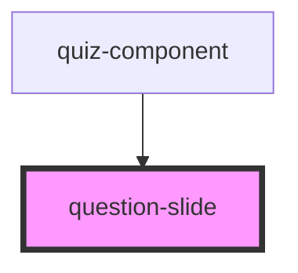

# question-slide

<!-- Auto Generated Below -->

## Properties

| Property  | Attribute | Description | Type                                  | Default     |
| --------- | --------- | ----------- | ------------------------------------- | ----------- |
| `answers` | --        |             | `{ text: string; points: number; }[]` | `undefined` |
| `index`   | `index`   |             | `number`                              | `undefined` |
| `text`    | `text`    |             | `string`                              | `undefined` |

## Events

| Event         | Description | Type                  |
| ------------- | ----------- | --------------------- |
| `answerClick` |             | `CustomEvent<number>` |

## Dependencies

### Used by

 - [quiz-component](../quiz-component)

### Graph

----------------------------------------------

*Built with [StencilJS](https://stenciljs.com/)*
