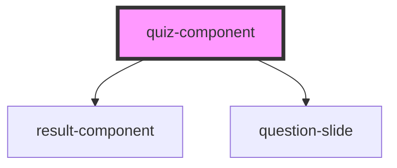

# my-component

<!-- Auto Generated Below -->

## Properties

| Property    | Attribute   | Description | Type     | Default     |
| ----------- | ----------- | ----------- | -------- | ----------- |
| `questions` | `questions` |             | `string` | `undefined` |
| `result`    | `result`    |             | `string` | `undefined` |

## Dependencies

### Depends on

- [result-component](../result-component)
- [question-slide](../question-slide)

### Graph

----------------------------------------------

*Built with [StencilJS](https://stenciljs.com/)*
