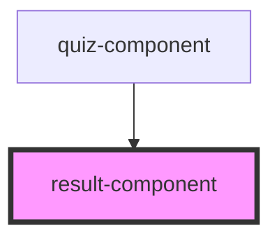

# result-component

<!-- Auto Generated Below -->

## Properties

| Property | Attribute | Description | Type     | Default |
| -------- | --------- | ----------- | -------- | ------- |
| `points` | `points`  |             | `number` | `0`     |
| `text`   | `text`    |             | `string` | `""`    |

## Events

| Event     | Description | Type                   |
| --------- | ----------- | ---------------------- |
| `restart` |             | `CustomEvent<boolean>` |

## Dependencies

### Used by

 - [quiz-component](../quiz-component)

### Graph

----------------------------------------------

*Built with [StencilJS](https://stenciljs.com/)*
